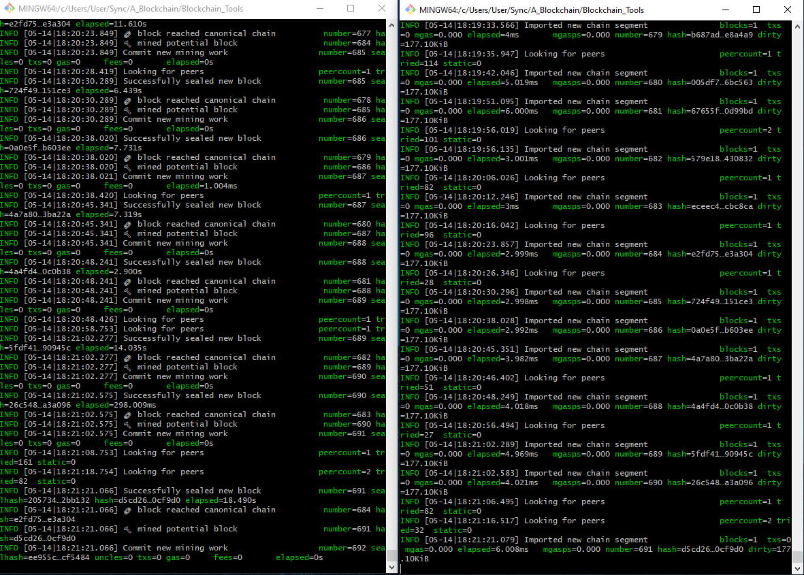
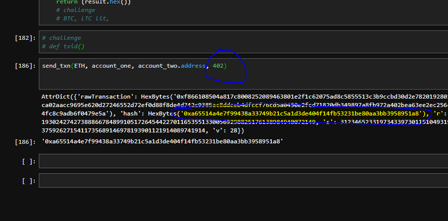
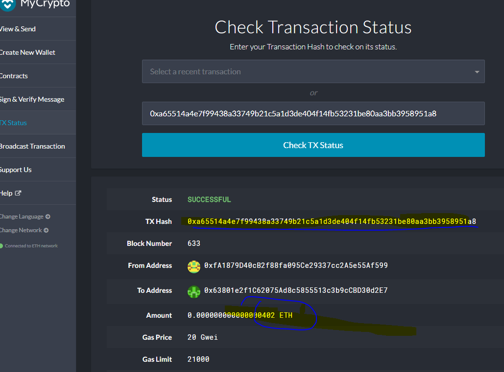
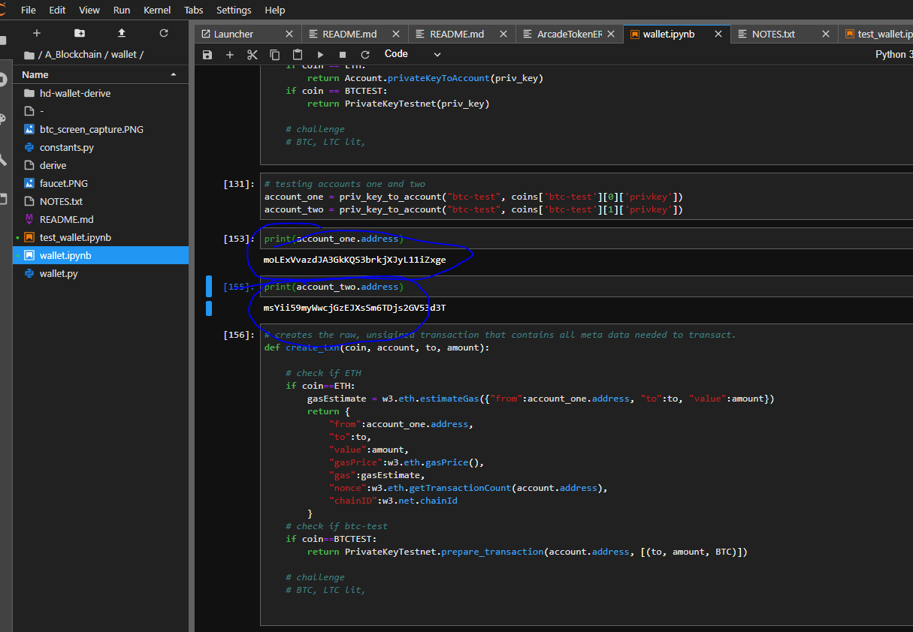
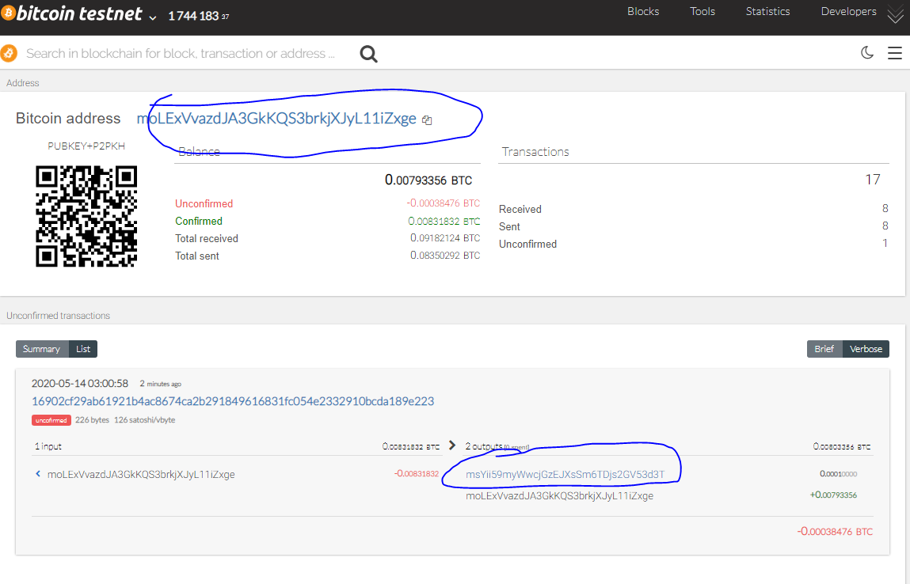

# Wallet Documentation

This wallet creates Hierarchical Deterministic Wallets (or HD wallets for short) based on BIP 44 standard. Using hd-wallet-derive, addresses can be derived for any coin. The wallet can support multiple coins based a single seed phrase. As such, the wallet can hold as many coins as desired. 

The wallet relies on php, so you must have it installed on your system. Load environment variables using .env file. Install all the libraries attached in requirements.txt. Using derive_wallets function, the wallet will generate an address, private key, public key, and path. 

The wallet also contains a create_txn function that creates a simple transfer between a first and second account for a particular coin. create_txn returns an object per each coin's specific library. 

The wallet contain a send_txn function that signs the transctions and broadcasts the transfer to the revelevant mainnet. 

## ETH example

The following code uses the first two derived address from hd-wallet-derive. The same addresses can be derived using the same seed phrase on BIP 44. 
'''
account_one = priv_key_to_account(ETH, coins[ETH][0]['privkey'])
account_two = priv_key_to_account(ETH, coins[ETH][1]['privkey'])
'''

If running geth locally, spin up at least two nodes and confirm that both are mining as below. Make sure you are running on your custom chain with the desired chainId.

Now, send a transction through Mycryto first. Due to a bug, the code will not run on an empty run chain. Sending eth via MyCrypto first, ensures, there is something on the chain before using the wallet. Then, use send_txn to send ether between account one and account two. Here, we are sending 402 wei. Make use to note the txn id, which will be returned in a dictionary for key "hash'.

Copy the hash into the TX Status in MyCrypto and note the successful transfer on your chain.

## BTCTEST example

The following code uses the first two derived address from hd-wallet-derive. The same addresses can be derived using the same seed phrase on BIP 44. 
'''
account_one = priv_key_to_account(BTCTEST, coins[BTCTEST][0]['privkey'])
account_two = priv_key_to_account(BTCTEST, coins[BTCTEST][1]['privkey'])
'''

The addresse can be printed and examined by indexing the resulting object.

Transfer BTCTEST between the two accounts using the create_txn and send_txn functions.

